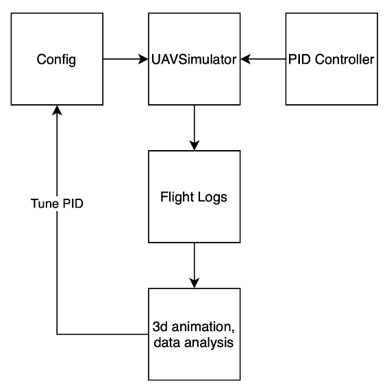

# uav-sim
Basic Unmanned Aerial Vehicle Simulator in 3-D using PID controllers for position. The goal of this project is to simulate
key aspects of autonomous vehicles, generate telemetry for post-flight analysis, and explore UAV testing and data visualizations.

# Project Structure and Design
```
uav-sim/
|  +-- uav_sim/
|  |   +-- config.py           # Configuration
|  |   +-- pid_controller.py   # PID control class
|  |   +-- simulator.py        # Simulates UAV movement
|  |   +-- sensor.py           # Simple noisy sensor simulator
|  |   +-- run_simulation.py   # Main entrypoint
|  |   +-- plot_3d.py          # Plot and analyze log data
|  |   +-- data_analysis.py    # Save all plots as .png files
|-- requirements.txt
```



# Configuration
Configuration can be found in [config.py](./uav_sim/config.py).

| Variable         | Description                                                                          | Default Value                                                                                                           |
|------------------|--------------------------------------------------------------------------------------|-------------------------------------------------------------------------------------------------------------------------|
| initial_position | Initial position of the UAV                                                          | [0.0, 0.0, 0.0]                                                                                                         |
| waypoints        | Waypoints for the UAV to hit, in order                                               | [[5.0, 0.0, 2.0],[5.0, 5.0, 2.0],[0.0, 5.0, 2.0],[0.0, 0.0, 2.0]]                                                       |
| max_velocity     | Maximum velocity that the drone can achieve                                          | 10.0                                                                                                                    |
| dt               | Timestep for the sim                                                                 | 0.01                                                                                                                    |
| sim_time         | Maximum allowable runtime of the sim                                                 | 40.0                                                                                                                    |
| tolerance        | Allowable distance between the UAV and a waypoint to mark it as successfully reached | 0.5                                                                                                                     |
| pid              | PID gains for each positional value                                                  | {"x": {"kp": 1.5, "ki": 0.0, "kd": 1.0},"y": {"kp": 1.5, "ki": 0.0, "kd": 1.0},"z": {"kp": 1.5, "ki": 0.0, "kd": 1.0},} |
| sensor_noise     | Simulated noisy sensor                                                               | 0.0                                                                                                                     |


PID controllers values are currently all treated the same, but are separate in the config for potential future enhancements
like introducing drag, wind, or real-world physics


# Run the simulation
Install the dependencies
```
pip install -r requirements.txt
```

```
cd uav_sim
python run_simulation.py
```

# Plot the results

Watch the trajectory in 3D!
```
cd uav_sim
python plot_3d.py
```

Save the all plots to files
```
cd uav_sim
python data_analysis.py
```

# Testing and Analysis

Some of the metrics for evaluating your system include:

| Metric                     | Why it matters                        |
|----------------------------|---------------------------------------|
| **Completion time**        | Shorter generally better              |
| **Total path length**      | Ideally close to minimal (no zig-zag) |
| **Overshoot**              | Should be minimized                   |
| **Settling time**          | Time taken to stabilize at a waypoint |
| **Number of oscillations** | Stability indicator                   |

Some insights for tuning the PID gains:
- Overshoot in velocity/position? 
  - Decrease proportional or increase derivative gain. 
- Drone oscillating near target? 
  - Increase damping (derivative gain). 
- Takes too long to reach target? 
  - Increase proportional gain or reduce integral windup limits.
